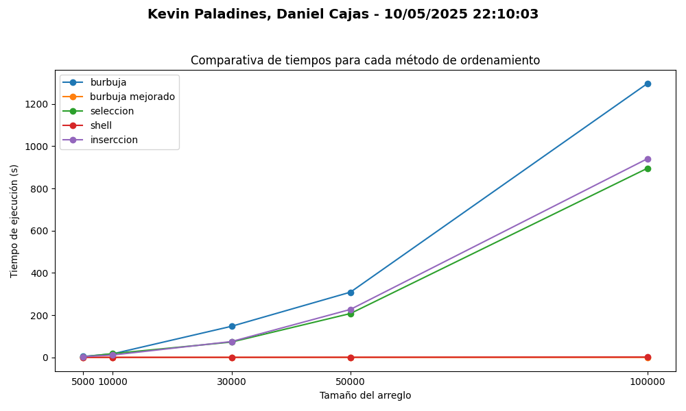

# Teoria de la complejidad

## 📌 Información General

- **Título:** Teoria de la complejidad
- **Asignatura:** Estructura de Datos
- **Carrera:** Computación
- **Estudiantes:** Daniel Cajas, Kevin Paladines
- **Fecha:** 11/05/2025
- **Profesor:** Ing. Pablo Torres

---

## 🛠️ Descripción

Archivo app.py : 
    - Archivo principal que coordina todo: ejecuta los métodos de ordenamiento, mide tiempos, genera 
      gráficos y muestra resultados.

Archivo benchmarking.py : 
    - Contiene la clase Benchmarking, que genera arreglos aleatorios y mide el tiempo que tarda cada 
      método en ordenarlos.


Archivo metodos_ordenamiento.py :
    - Incluye varios algoritmos de ordenamiento (burbuja, mejorado, selección, inserción, shell) usados
     para comparar rendimiento.

Archivo generar_arreglos.py:
    - Tiene la estructura de "tamanios = [5000, 10000, 30000, 50000, 100000]" el cual genera numeros randoms segun
     la cantidad de datos que se da en "tamanios" procurando que sean los mismos datos del primero para
     el segundo y asi susesivamente.

---
## 🚀 Ejecución

Para ejecutar el proyecto:

1. Compila el código:
    ```bash
    javac App.java
    ```
2. Ejecuta la aplicación:
    ```bash
    java App
    ```

---
## 🧑‍💻 Ejemplo de Entrada y Salida

```plaintext

Iniciando el programa...
Benchmarking instanciado

--- Resultados de tiempo mediante los metodos de ordenamiento ---

Tamaño: 5000, Metodo: burbuja, Tiempo: 5.189110 segundos
Tamaño: 5000, Metodo: burbuja mejorado, Tiempo: 0.001256 segundos 
Tamaño: 5000, Metodo: seleccion, Tiempo: 3.508979 segundos        
Tamaño: 5000, Metodo: shell, Tiempo: 0.089093 segundos
Tamaño: 5000, Metodo: inserccion, Tiempo: 5.530632 segundos       
Tamaño: 10000, Metodo: burbuja, Tiempo: 16.499031 segundos        
Tamaño: 10000, Metodo: burbuja mejorado, Tiempo: 0.004510 segundos
Tamaño: 10000, Metodo: seleccion, Tiempo: 19.793300 segundos      
Tamaño: 10000, Metodo: shell, Tiempo: 0.334525 segundos
Tamaño: 10000, Metodo: inserccion, Tiempo: 14.740177 segundos     
Tamaño: 30000, Metodo: burbuja, Tiempo: 149.241122 segundos       
Tamaño: 30000, Metodo: burbuja mejorado, Tiempo: 0.015517 segundos
Tamaño: 30000, Metodo: seleccion, Tiempo: 86.491607 segundos
Tamaño: 30000, Metodo: shell, Tiempo: 0.614775 segundos     
Tamaño: 30000, Metodo: inserccion, Tiempo: 84.749231 segundos
Tamaño: 50000, Metodo: burbuja, Tiempo: 331.414070 segundos  
Tamaño: 50000, Metodo: burbuja mejorado, Tiempo: 0.014435 segundos
Tamaño: 50000, Metodo: seleccion, Tiempo: 242.239603 segundos      
Tamaño: 50000, Metodo: shell, Tiempo: 0.613967 segundos
Tamaño: 50000, Metodo: inserccion, Tiempo: 317.417355 segundos     
Tamaño: 100000, Metodo: burbuja, Tiempo: 1725.464540 segundos      
Tamaño: 100000, Metodo: burbuja mejorado, Tiempo: 0.060728 segundos
Tamaño: 100000, Metodo: seleccion, Tiempo: 1277.282692 segundos    
Tamaño: 100000, Metodo: shell, Tiempo: 2.446053 segundos        
Tamaño: 100000, Metodo: inserccion, Tiempo: 1394.410015 segundos

--- Arreglos generados ---

Arreglo de 5000: 
[55183, 80341, 27587, 21225, 35121, 41812, 20621, 31047, 21955, 81257, 52346, 74126, 15716, 40295, 51744, 76299, 33517, 62657, 24634, 83674, 46429, 93182, 9159, 14334, 81456, 84278, 68073, 64819, 55142, 81789, 92936, 83826, 10457, 20505, 15617, 44808, 56188, 61166, 77645, 87405, 37214, 16543, 55536, 78441, 75135, 28479, 77464, 41197, 36305, 65476, 51977, 72734, 57274, 20598, 3595, 93604, 37253, 10315, 35295, 53824, 30565, 8077, 79608, 43554, 54667, 11325, 8613, 67859, 85025, 78902, 41008, 10430, 17757, 7590, 55064, 35116, 71277, 18210, 7311, 37016, 42671, 57543, 45255, 76806, 69629, 66379, 56034, 12431, 48856, 68435, 85841, 
65859, 66750, 45477, 11730, 16885, 81451, 44838, 17229, 57018, 22026, 10036, 56684, 21641, 46888, 74734, 55641, 7667, 73667, 57506, 72577, 9910, 17290, 24858, 49195, 17136, 73972, 65975, 4527, 56966, 55870, 3850, 28300, 486, 43681, 43968, 52646, 90980, 11026, 1259, 34891, 44188, 37751, 77584, 77185, 25985, 66907, 97210, 75659, 52064, 16699, 80583, 92384, 75600, 81651, 73796, 30194, 27, 52765, 58672, 39925, 47254, 59489, 30940, 20904, 47733, 46936, 29655, 24324, 103, 19254, 34290, 55325, 96037, 57568, 77358, 30625, 55136, 30634, 94289, 90319, 4419, 13817, 88696, 73502, 26752, 50000, 5822, 68209, 51365, 73301, 40845, 31197, 15874, 14851, 12467, 43676, 70582, 819, 22686, 32449, 96340, 414, 72111, 46622, 98143, 32024, 84341, 94191, 5488, 78223, 58312, 13054, 74082, 39538, 32067, 61245, 85517, 19307, 72505, 3152, 19010, 73610, 32203, 43308, 16308, 48413, 53481, 32180, 41632, 30700, 92342, 74832, 21343, 93727, 53744, 77390, 92460, 58937, 93763, 76007, 30292, 82408, 33849, 395, 58644, 70909, 75174, 72189, 28779, 11366, 27396, 4497, 57376, 89415, 20387, 39953, 29377, 28919, 16655, 45359, 52232, 5521, 99248, 76426, 92641, 95729, 68792, 50664, 6243, 99361, 44196, 75911, 33135, 73538, 34263, 26248, 24537, 42505, 62101, 96683, 12197, 4760, 89946, 71823, 38188, 17175, 65220, 94144, 69843, 7265, 20068, 10297, 45284, 99298, 53468, 20048, 22290, 3880, 85088, 95172, 75404, 90768, 83607, 12534, 40348, 80521, 21315, 61371, 93796, 93373, 37249, 40830, 89388, 66563, 77862, 89583, 22929, 4357, 57390, 73873, 94234, 54057, 65202, 58278, 30627, 16309, 19365, 48067, 80381, 46939, 47947, 88406, 35753, 36820, 15714, 33041, 82101, 34264, 6728, 47318, 19609, 54395, 31267, 13669, 79322, 18022, 84776, 71777, 4130, 54619, 55118, 97069, 69471, 94051, 47568, 55284, 64744, 43083, 73635, 73183, 40858, 53314, 58654, 53322, 55030, 66811, 26141, 87782, 16660, 83499, 44282, 92286, 77526, 13927, 78964, 1321, 65664, 49682, 9506, 89002, 69840, 49846, 89119, 97739, 80746, 96085, 81741, 91428, 97078, 32481, 43864, 81406, 20400, 70548, 91744, 1894, 86486, 78971, 58517, 38484, 96950, 66634, 76147, 5313, 81748, 49185, 20915, 19221, 60434, 50044, 17608, 21337, 30430, 95549, 24632, 69552, 53835, 59021, 85250, 84266, 84450, 
31247, 60821, 96131, 11052, 71884, 36320, 61017, 91138, 10824, 8108, 19426, 57152, 58091, 77105, 58331, 61074, 70780, 78408, 46625, 52598, 53865, 44599, 60042, 51238, 34996, 76889, 54701, 46207, 57010, 61180, 31116, 31967, 94713, 31137, 95395, 4146, 80432, 14337, 14364, 27075, 56312, 44333, 62701, 25046, 53955, 39592, 10378, 3512, 36047, 57661, 2647, 81561, 71410, 83176, 32904, 53847, 94246, 60381, 44165, 19875, 69102, 86822, 69939, 8955, 17547, 2339, 45586, 68638, 71876, 3528, 12695, 491, 78194, 73905, 48930, 45604, 7075, 28614, 31235, 11899, 11828, 81391, 7687, 84567, 50470, 30595, 77954, 90411, 23833, 18819, 85910, 51093, 30996, 53971, 3792, 94573, 40460, 40137, 94274, 69289, 80719, 37084, 61958, 13238, 34518, 73719, 59069, 85982, 4478, 27943, 42560, 14818, 82836, 89544, 48550, 90735, 68874, 80005, 98524, 37359, 39205, 47188, 38032, 53175, 32651, 82552, 44958, 36454, 82136, 78260, 22037, 54722, 99099, 79611, 51219, 35973, 27483, 98765, 52271, 83582, 9443, 87610, 303, 66920, 79636, 34345, 7898, 54816, 9135, 30177, 37669, 28772, 62765, 94128, 6217, 48497, 54566, 41478, 88502, 93055, 6577, 49942, 7635, 9706, 41398, 1437, 98620, 30290, 41714, 53263, 54578, 1331, 43041, 66578, 17000, 40820, 11637, 31919, 65335, 19272, 517, 23853, 67467, 75784, 87308, 99433, 29700, 7604, 77026, 8911, 75336, 79008, 27240, 585, 31161, 1969, 59604, 29302, 6825, 4563, 38874, 36841, 62253, 35774, 7674, 72060, 59313, 64614, 
64081, 66151, 58688, 28289, 25456, 78520, 51404, 37355, 56798, 45240, 37619, 4476, 63524, 37441, 87899, 67877, 67938, 40582, 27490, 6791, 70274, 37863, 39849, 22748, 44486, 87979, 78813, 67796, 90105, 19734, 52408, 22785, 59792, 43713, 83280, 83727, 85890, 6913, 43707, 1145, 51705, 3513, 46476, 44211, 67275, 4015, 
22110, 7856, 54746, 3822, 42319, 44409, 367, 42271, 82778, 63701, 26547, 71427, 16539, 61994, 99461, 52223, 73350, 10019, 86989, 78147, 17225, 11031, 84509, 3603, 71288, 32128, 84153, 90609, 42860, 97874, 63110, 13122, 51303, 46525, 88838, 41739, 85956, 84141, 17912, 23043, 23102, 93107, 45376, 20587, 6155, 20941, 
34296, 69357, 81124, 44916, 75046, 48388, 18034, 18716, 12142, 77026, 14270, 19461, 17179, 63093, 59213, 25819, 35953, 89154, 18835, 97269, 95713, 69457, 2808, 25326, 96380, 80270, 49466, 98829, 20803, 6379, 38257, 5464, 54138, 58138, 51496, 14641, 16502, 87649, 35424, 38560, 80942, 51551, 94730, 15236, 66430, 30111, 21358, 70684, 25939, 63178, 42930, 79840, 97268, 60226, 53004, 392, 48269, 24859, 82656, 81320, 81830, 6547, 92687, 3698, 7768, 71690, 38018, 83281, 37106, 46531, 59517, 64714, 54249, 23097, 525, 24206, 84979, 93930, 90551, 61263, 42374, 87187, 85680, 56307, 45489, 49612, 72211, 79213, 75311, 62046, 68296, 51494, 92315, 17579, 91765, 11360, 64201, 20100, 13992, 60696, 73942, 25971, 95750, 66075, 11776, 99767, 21689, 7548, 82718, 56140, 22113, 21302, 4948, 52170, 34877, 81444, 91611, 56657, 54859, 52816, 12482, 13519, 98131, 21423, 32570, 44669, 97393, 40962, 67663, 32090, 74685, 5551, 86524, 10905, 23895, 68645, 20090, 15917, 85636, 96391, 38301, 13330, 89532, 30439, 35087, 47795, 51727, 41122, 91163, 45808, 74710, 15518, 60942, 46080, 50054, 8563, 1307, 51044, 85887, 24188, 41287, 51217, 55425, 98731, 17004, 20391, 10790, 22886, 81022, 32231, 52994, 60402, 62702, 63092, 30984, 31770, 5269, 74601, 31864, 12371, 29517, 5058, 34216, 
2251, 11292, 4100, 48851, 53089, 71818, 69641, 74686, 11406, 78513, 61993, 24846, 71918, 16086, 30308, 42096, 67636, 27348, 92791, 98303, 48695, 32370, 97891, 96718, 86275, 69991, 93367, 45839, 89591, 44995, 30011, 81604, 96680, 40063, 67285, 2194, 36523, 97662, 83085, 18754, 94910, 14575, 2724, 19536, 72589, 53285, 46619, 85923, 72395, 46658, 94212, 17777, 45461, 64119, 44404, 19493, 69164, 60183, 34492, 73624, 86739, 52557, 21100, 31274, 95192, 74129, 30191, 48337, 85462, 86957, 42368, 8496, 88439, 27560, 87104, 1099, 50223, 43939, 73556, 65779, 73959, 40516, 53344, 80825, 20294, 44863, 85978, 67194, 36892, 67464, 75257, 48616, 15069, 64369, 8667, 82706, 57330, 72028, 17320, 22173, 94551, 16579, 16294, 12319, 77691, 7633, 9436, 71261, 10944, 18325, 34122, 20332, 71781, 39005, 76747, 87226, 13719, 21587, 21629, 92852, 25881, 63368, 87095, 30345, 82373, 11086, 25063, 67490, 89061, 47203, 35775, 46727, 38578, 26166, 75443, 55608, 33615, 6529, 7421, 36926, 15275, 1216, 89032, 97801, 20751, 24978, 67415, 2633, 56471, 39824, 42642, 97531, 72018, 27775, 51420, 63754, 34807, 62123, 1695, 94592, 
47547, 20195, 81191, 76686, 30126, 1094, 54979, 82557, 95234, 28431, 88133, 97082, 35513, 76452, 53720, 22924, 8762, 77742, 59260, 12973, 81818, 36044, 63930, 75467, 75760, 42824, 73598, 2274, 24234, 47035, 29095, 37401, 33913, 91132, 34525, 60624, 6257, 36164, 88450, 13975, 82814, 16744, 53779, 26679, 67009, 72210, 16857, 90300, 33651, 23004, 2562, 15537, 11961, 78312, 76273, 34540, 94754, 13711, 92743, 96140, 13398, 5494, 93904, 68677, 92716, 22264, 62674, 99174, 56158, 65673, 1325, 2887, 31885, 99046, 64677, 55128, 69918, 30876, 49080, 88270, 73697, 70291, 19242, 91296, 78568, 86044, 93279, 74658, 71820, 40689, 71929, 64789, 66616, 97249, 50526, 65170, 12760, 38267, 62209, 90592, 10567, 90709, 31931, 72666, 10761, 49888, 55618, 4372, 77250, 41993, 58810, 27461, 25355, 75700, 84484, 64955, 80759, 9346, 34918, 74095, 92625, 98691, 23762, 46231, 17878, 13615, 92908, 29801, 22695, 15913, 94471, 78655, 16831, 68187, 59897, 30663, 63087, 52848, 42956, 79965, 37702, 45327, 38457, 31851, 65797, 74587, 67451, 32240, 22703, 58539, 12545, 32844, 71936, 83694, 15596, 2977, 69392, 27985, 27670, 51002, 83885, 95006, 67933, 99062, 21333, 9666, 28607, 21965, 31465, 74410, 17778, 54848, 96380, 22255, 45183, 89372, 74438, 32772, 82728, 29670, 72492, 76752, 60261, 3550, 71047, 14734, 78352, 69613, 65113, 91710, 84000, 77444, 20758, 1619]

Arreglo de 10000:
[55183, 80341, 27587, 21225, 35121, 41812, 20621, 31047, 21955, 81257, 52346, 74126, 15716, 40295, 51744, 76299, 33517, 62657, 24634, 83674, 46429, 93182, 9159, 14334, 81456, 84278, 68073, 64819, 55142, 81789, 92936, 83826, 10457, 20505, 15617, 44808, 56188, 61166, 77645, 87405, 37214, 16543, 55536, 78441, 75135, 28479, 77464, 41197, 36305, 65476, 51977, 72734, 57274, 20598, 3595, 93604, 37253, 10315, 35295, 53824, 30565, 8077, 79608, 43554, 54667, 11325, 8613, 67859, 85025, 78902, 41008, 10430, 17757, 7590, 55064, 35116, 71277, 18210, 7311, 37016, 42671, 57543, 45255, 76806, 69629, 66379, 56034, 12431, 48856, 68435, 85841, 
65859, 66750, 45477, 11730, 16885, 81451, 44838, 17229, 57018, 22026, 10036, 56684, 21641, 46888, 74734, 55641, 7667, 73667, 57506, 72577, 9910, 17290, 24858, 49195, 17136, 73972, 65975, 4527, 56966, 55870, 3850, 28300, 486, 43681, 43968, 52646, 90980, 11026, 1259, 34891, 44188, 37751, 77584, 77185, 25985, 66907, 97210, 75659, 52064, 16699, 80583, 92384, 75600, 81651, 73796, 30194, 27, 52765, 58672, 39925, 47254, 59489, 30940, 20904, 47733, 46936, 29655, 24324, 103, 19254, 34290, 55325, 96037, 57568, 77358, 30625, 55136, 30634, 94289, 90319, 4419, 13817, 88696, 73502, 26752, 50000, 5822, 68209, 51365, 73301, 40845, 31197, 15874, 14851, 12467, 43676, 70582, 819, 22686, 32449, 96340, 414, 72111, 46622, 98143, 32024, 84341, 94191, 5488, 78223, 58312, 13054, 74082, 39538, 32067, 61245, 85517, 19307, 72505, 3152, 19010, 73610, 32203, 43308, 16308, 48413, 53481, 32180, 41632, 30700, 92342, 74832, 21343, 93727, 53744, 77390, 92460, 58937, 93763, 76007, 30292, 82408, 33849, 395, 58644, 70909, 75174, 72189, 28779, 11366, 27396, 4497, 57376, 89415, 20387, 39953, 29377, 28919, 16655, 45359, 52232, 5521, 99248, 76426, 92641, 95729, 68792, 50664, 6243, 99361, 44196, 75911, 33135, 73538, 34263, 26248, 24537, 42505, 62101, 96683, 12197, 4760, 89946, 71823, 38188, 17175, 65220, 94144, 69843, 7265, 20068, 10297, 45284, 99298, 53468, 20048, 22290, 3880, 85088, 95172, 75404, 90768, 83607, 12534, 40348, 80521, 21315, 61371, 93796, 93373, 37249, 40830, 89388, 66563, 77862, 89583, 22929, 4357, 57390, 73873, 94234, 54057, 65202, 58278, 30627, 16309, 19365, 48067, 80381, 46939, 47947, 88406, 35753, 36820, 15714, 33041, 82101, 34264, 6728, 47318, 19609, 54395, 31267, 13669, 79322, 18022, 84776, 71777, 4130, 54619, 55118, 97069, 69471, 94051, 47568, 55284, 64744, 43083, 73635, 73183, 40858, 53314, 58654, 53322, 55030, 66811, 26141, 87782, 16660, 83499, 44282, 92286, 77526, 13927, 78964, 1321, 65664, 49682, 9506, 89002, 69840, 49846, 89119, 97739, 80746, 96085, 81741, 91428, 97078, 32481, 43864, 81406, 20400, 70548, 91744, 1894, 86486, 78971, 58517, 38484, 96950, 66634, 76147, 5313, 81748, 49185, 20915, 19221, 60434, 50044, 17608, 21337, 30430, 95549, 24632, 69552, 53835, 59021, 85250, 84266, 84450, 
31247, 60821, 96131, 11052, 71884, 36320, 61017, 91138, 10824, 8108, 19426, 57152, 58091, 77105, 58331, 61074, 70780, 78408, 46625, 52598, 53865, 44599, 60042, 51238, 34996, 76889, 54701, 46207, 57010, 61180, 31116, 31967, 94713, 31137, 95395, 4146, 80432, 14337, 14364, 27075, 56312, 44333, 62701, 25046, 53955, 39592, 10378, 3512, 36047, 57661, 2647, 81561, 71410, 83176, 32904, 53847, 94246, 60381, 44165, 19875, 69102, 86822, 69939, 8955, 17547, 2339, 45586, 68638, 71876, 3528, 12695, 491, 78194, 73905, 48930, 45604, 7075, 28614, 31235, 11899, 11828, 81391, 7687, 84567, 50470, 30595, 77954, 90411, 23833, 18819, 85910, 51093, 30996, 53971, 3792, 94573, 40460, 40137, 94274, 69289, 80719, 37084, 61958, 13238, 34518, 73719, 59069, 85982, 4478, 27943, 42560, 14818, 82836, 89544, 48550, 90735, 68874, 80005, 98524, 37359, 39205, 47188, 38032, 53175, 32651, 82552, 44958, 36454, 82136, 78260, 22037, 54722, 99099, 79611, 51219, 35973, 27483, 98765, 52271, 83582, 9443, 87610, 303, 66920, 79636, 34345, 7898, 54816, 9135, 30177, 37669, 28772, 62765, 94128, 6217, 48497, 54566, 41478, 88502, 93055, 6577, 49942, 7635, 9706, 41398, 1437, 98620, 30290, 41714, 53263, 54578, 1331, 43041, 66578, 17000, 40820, 11637, 31919, 65335, 19272, 517, 23853, 67467, 75784, 87308, 99433, 29700, 7604, 77026, 8911, 75336, 79008, 27240, 585, 31161, 1969, 59604, 29302, 6825, 4563, 38874, 36841, 62253, 35774, 7674, 72060, 59313, 64614, 
64081, 66151, 58688, 28289, 25456, 78520, 51404, 37355, 56798, 45240, 37619, 4476, 63524, 37441, 87899, 67877, 67938, 40582, 27490, 6791, 70274, 37863, 39849, 22748, 44486, 87979, 78813, 67796, 90105, 19734, 52408, 22785, 59792, 43713, 83280, 83727, 85890, 6913, 43707, 1145, 51705, 3513, 46476, 44211, 67275, 4015, 
22110, 7856, 54746, 3822, 42319, 44409, 367, 42271, 82778, 63701, 26547, 71427, 16539, 61994, 99461, 52223, 73350, 10019, 86989, 78147, 17225, 11031, 84509, 3603, 71288, 32128, 84153, 90609, 42860, 97874, 63110, 13122, 51303, 46525, 88838, 41739, 85956, 84141, 17912, 23043, 23102, 93107, 45376, 20587, 6155, 20941, 
34296, 69357, 81124, 44916, 75046, 48388, 18034, 18716, 12142, 77026, 14270, 19461, 17179, 63093, 59213, 25819, 35953, 89154, 18835, 97269, 95713, 69457, 2808, 25326, 96380, 80270, 49466, 98829, 20803, 6379, 38257, 5464, 54138, 58138, 51496, 14641, 16502, 87649, 35424, 38560, 80942, 51551, 94730, 15236, 66430, 30111, 21358, 70684, 25939, 63178, 42930, 79840, 97268, 60226, 53004, 392, 48269, 24859, 82656, 81320, 81830, 6547, 92687, 3698, 7768, 71690, 38018, 83281, 37106, 46531, 59517, 64714, 54249, 23097, 525, 24206, 84979, 93930, 90551, 61263, 42374, 87187, 85680, 56307, 45489, 49612, 72211, 79213, 75311, 62046, 68296, 51494, 92315, 17579, 91765, 11360, 64201, 20100, 13992, 60696, 73942, 25971, 95750, 66075, 11776, 99767, 21689, 7548, 82718, 56140, 22113, 21302, 4948, 52170, 34877, 81444, 91611, 56657, 54859, 52816, 12482, 13519, 98131, 21423, 32570, 44669, 97393, 40962, 67663, 32090, 74685, 5551, 86524, 10905, 23895, 68645, 20090, 15917, 85636, 96391, 38301, 13330, 89532, 30439, 35087, 47795, 51727, 41122, 91163, 45808, 74710, 15518, 60942, 46080, 50054, 8563, 1307, 51044, 85887, 24188, 41287, 51217, 55425, 98731, 17004, 20391, 10790, 22886, 81022, 32231, 52994, 60402, 62702, 63092, 30984, 31770, 5269, 74601, 31864, 12371, 29517, 5058, 34216, 
2251, 11292, 4100, 48851, 53089, 71818, 69641, 74686, 11406, 78513, 61993, 24846, 71918, 16086, 30308, 42096, 67636, 27348, 92791, 98303, 48695, 32370, 97891, 96718, 86275, 69991, 93367, 45839, 89591, 44995, 30011, 81604, 96680, 40063, 67285, 2194, 36523, 97662, 83085, 18754, 94910, 14575, 2724, 19536, 72589, 53285, 46619, 85923, 72395, 46658, 94212, 17777, 45461, 64119, 44404, 19493, 69164, 60183, 34492, 73624, 86739, 52557, 21100, 31274, 95192, 74129, 30191, 48337, 85462, 86957, 42368, 8496, 88439, 27560, 87104, 1099, 50223, 43939, 73556, 65779, 73959, 40516, 53344, 80825, 20294, 44863, 85978, 67194, 36892, 67464, 75257, 48616, 15069, 64369, 8667, 82706, 57330, 72028, 17320, 22173, 94551, 16579, 16294, 12319, 77691, 7633, 9436, 71261, 10944, 18325, 34122, 20332, 71781, 39005, 76747, 87226, 13719, 21587, 21629, 92852, 25881, 63368, 87095, 30345, 82373, 11086, 25063, 67490, 89061, 47203, 35775, 46727, 38578, 26166, 75443, 55608, 33615, 6529, 7421, 36926, 15275, 1216, 89032, 97801, 20751, 24978, 67415, 2633, 56471, 39824, 42642, 97531, 72018, 27775, 51420, 63754, 34807, 62123, 1695, 94592, 
47547, 20195, 81191, 76686, 30126, 1094, 54979, 82557, 95234, 28431, 88133, 97082, 35513, 76452, 53720, 22924, 8762, 77742, 59260, 12973, 81818, 36044, 63930, 75467, 75760, 42824, 73598, 2274, 24234, 47035, 29095, 37401, 33913, 91132, 34525, 60624, 6257, 36164, 88450, 13975, 82814, 16744, 53779, 26679, 67009, 72210, 16857, 90300, 33651, 23004, 2562, 15537, 11961, 78312, 76273, 34540, 94754, 13711, 92743, 96140, 13398, 5494, 93904, 68677, 92716, 22264, 62674, 99174, 56158, 65673, 1325, 2887, 31885, 99046, 64677, 55128, 69918, 30876, 49080, 88270, 73697, 70291, 19242, 91296, 78568, 86044, 93279, 74658, 71820, 40689, 71929, 64789, 66616, 97249, 50526, 65170, 12760, 38267, 62209, 90592, 10567, 90709, 31931, 72666, 10761, 49888, 55618, 4372, 77250, 41993, 58810, 27461, 25355, 75700, 84484, 64955, 80759, 9346, 34918, 74095, 92625, 98691, 23762, 46231, 17878, 13615, 92908, 29801, 22695, 15913, 94471, 78655, 16831, 68187, 59897, 30663, 63087, 52848, 42956, 79965, 37702, 45327, 38457, 31851, 65797, 74587, 67451, 32240, 22703, 58539, 12545, 32844, 71936, 83694, 15596, 2977, 69392, 27985, 27670, 51002, 83885, 95006, 67933, 99062, 21333, 9666, 28607, 21965, 31465, 74410, 17778, 54848, 96380, 22255, 45183, 89372, 74438, 32772, 82728, 29670, 72492, 76752, 60261, 3550, 71047, 14734, 78352, 69613, 65113, 91710, 84000, 77444, 20758, 1]

Arreglo de 30000:
[55183, 80341, 27587, 21225, 35121, 41812, 20621, 31047, 21955, 81257, 52346, 74126, 15716, 40295, 51744, 76299, 33517, 62657, 24634, 83674, 46429, 93182, 9159, 14334, 81456, 84278, 68073, 64819, 55142, 81789, 92936, 83826, 10457, 20505, 15617, 44808, 56188, 61166, 77645, 87405, 37214, 16543, 55536, 78441, 75135, 28479, 77464, 41197, 36305, 65476, 51977, 72734, 57274, 20598, 3595, 93604, 37253, 10315, 35295, 53824, 30565, 8077, 79608, 43554, 54667, 11325, 8613, 67859, 85025, 78902, 41008, 10430, 17757, 7590, 55064, 35116, 71277, 18210, 7311, 37016, 42671, 57543, 45255, 76806, 69629, 66379, 56034, 12431, 48856, 68435, 85841, 
65859, 66750, 45477, 11730, 16885, 81451, 44838, 17229, 57018, 22026, 10036, 56684, 21641, 46888, 74734, 55641, 7667, 73667, 57506, 72577, 9910, 17290, 24858, 49195, 17136, 73972, 65975, 4527, 56966, 55870, 3850, 28300, 486, 43681, 43968, 52646, 90980, 11026, 1259, 34891, 44188, 37751, 77584, 77185, 25985, 66907, 97210, 75659, 52064, 16699, 80583, 92384, 75600, 81651, 73796, 30194, 27, 52765, 58672, 39925, 47254, 59489, 30940, 20904, 47733, 46936, 29655, 24324, 103, 19254, 34290, 55325, 96037, 57568, 77358, 30625, 55136, 30634, 94289, 90319, 4419, 13817, 88696, 73502, 26752, 50000, 5822, 68209, 51365, 73301, 40845, 31197, 15874, 14851, 12467, 43676, 70582, 819, 22686, 32449, 96340, 414, 72111, 46622, 98143, 32024, 84341, 94191, 5488, 78223, 58312, 13054, 74082, 39538, 32067, 61245, 85517, 19307, 72505, 3152, 19010, 73610, 32203, 43308, 16308, 48413, 53481, 32180, 41632, 30700, 92342, 74832, 21343, 93727, 53744, 77390, 92460, 58937, 93763, 76007, 30292, 82408, 33849, 395, 58644, 70909, 75174, 72189, 28779, 11366, 27396, 4497, 57376, 89415, 20387, 39953, 29377, 28919, 16655, 45359, 52232, 5521, 99248, 76426, 92641, 95729, 68792, 50664, 6243, 99361, 44196, 75911, 33135, 73538, 34263, 26248, 24537, 42505, 62101, 96683, 12197, 4760, 89946, 71823, 38188, 17175, 65220, 94144, 69843, 7265, 20068, 10297, 45284, 99298, 53468, 20048, 22290, 3880, 85088, 95172, 75404, 90768, 83607, 12534, 40348, 80521, 21315, 61371, 93796, 93373, 37249, 40830, 89388, 66563, 77862, 89583, 22929, 4357, 57390, 73873, 94234, 54057, 65202, 58278, 30627, 16309, 19365, 48067, 80381, 46939, 47947, 88406, 35753, 36820, 15714, 33041, 82101, 34264, 6728, 47318, 19609, 54395, 31267, 13669, 79322, 18022, 84776, 71777, 4130, 54619, 55118, 97069, 69471, 94051, 47568, 55284, 64744, 43083, 73635, 73183, 40858, 53314, 58654, 53322, 55030, 66811, 26141, 87782, 16660, 83499, 44282, 92286, 77526, 13927, 78964, 1321, 65664, 49682, 9506, 89002, 69840, 49846, 89119, 97739, 80746, 96085, 81741, 91428, 97078, 32481, 43864, 81406, 20400, 70548, 91744, 1894, 86486, 78971, 58517, 38484, 96950, 66634, 76147, 5313, 81748, 49185, 20915, 19221, 60434, 50044, 17608, 21337, 30430, 95549, 24632, 69552, 53835, 59021, 85250, 84266, 84450, 
31247, 60821, 96131, 11052, 71884, 36320, 61017, 91138, 10824, 8108, 19426, 57152, 58091, 77105, 58331, 61074, 70780, 78408, 46625, 52598, 53865, 44599, 60042, 51238, 34996, 76889, 54701, 46207, 57010, 61180, 31116, 31967, 94713, 31137, 95395, 4146, 80432, 14337, 14364, 27075, 56312, 44333, 62701, 25046, 53955, 39592, 10378, 3512, 36047, 57661, 2647, 81561, 71410, 83176, 32904, 53847, 94246, 60381, 44165, 19875, 69102, 86822, 69939, 8955, 17547, 2339, 45586, 68638, 71876, 3528, 12695, 491, 78194, 73905, 48930, 45604, 7075, 28614, 31235, 11899, 11828, 81391, 7687, 84567, 50470, 30595, 77954, 90411, 23833, 18819, 85910, 51093, 30996, 53971, 3792, 94573, 40460, 40137, 94274, 69289, 80719, 37084, 61958, 13238, 34518, 73719, 59069, 85982, 4478, 27943, 42560, 14818, 82836, 89544, 48550, 90735, 68874, 80005, 98524, 37359, 39205, 47188, 38032, 53175, 32651, 82552, 44958, 36454, 82136, 78260, 22037, 54722, 99099, 79611, 51219, 35973, 27483, 98765, 52271, 83582, 9443, 87610, 303, 66920, 79636, 34345, 7898, 54816, 9135, 30177, 37669, 28772, 62765, 94128, 6217, 48497, 54566, 41478, 88502, 93055, 6577, 49942, 7635, 9706, 41398, 1437, 98620, 30290, 41714, 53263, 54578, 1331, 43041, 66578, 17000, 40820, 11637, 31919, 65335, 19272, 517, 23853, 67467, 75784, 87308, 99433, 29700, 7604, 77026, 8911, 75336, 79008, 27240, 585, 31161, 1969, 59604, 29302, 6825, 4563, 38874, 36841, 62253, 35774, 7674, 72060, 59313, 64614, 
64081, 66151, 58688, 28289, 25456, 78520, 51404, 37355, 56798, 45240, 37619, 4476, 63524, 37441, 87899, 67877, 67938, 40582, 27490, 6791, 70274, 37863, 39849, 22748, 44486, 87979, 78813, 67796, 90105, 19734, 52408, 22785, 59792, 43713, 83280, 83727, 85890, 6913, 43707, 1145, 51705, 3513, 46476, 44211, 67275, 4015, 
22110, 7856, 54746, 3822, 42319, 44409, 367, 42271, 82778, 63701, 26547, 71427, 16539, 61994, 99461, 52223, 73350, 10019, 86989, 78147, 17225, 11031, 84509, 3603, 71288, 32128, 84153, 90609, 42860, 97874, 63110, 13122, 51303, 46525, 88838, 41739, 85956, 84141, 17912, 23043, 23102, 93107, 45376, 20587, 6155, 20941, 
34296, 69357, 81124, 44916, 75046, 48388, 18034, 18716, 12142, 77026, 14270, 19461, 17179, 63093, 59213, 25819, 35953, 89154, 18835, 97269, 95713, 69457, 2808, 25326, 96380, 80270, 49466, 98829, 20803, 6379, 38257, 5464, 54138, 58138, 51496, 14641, 16502, 87649, 35424, 38560, 80942, 51551, 94730, 15236, 66430, 30111, 21358, 70684, 25939, 63178, 42930, 79840, 97268, 60226, 53004, 392, 48269, 24859, 82656, 81320, 81830, 6547, 92687, 3698, 7768, 71690, 38018, 83281, 37106, 46531, 59517, 64714, 54249, 23097, 525, 24206, 84979, 93930, 90551, 61263, 42374, 87187, 85680, 56307, 45489, 49612, 72211, 79213, 75311, 62046, 68296, 51494, 92315, 17579, 91765, 11360, 64201, 20100, 13992, 60696, 73942, 25971, 95750, 66075, 11776, 99767, 21689, 7548, 82718, 56140, 22113, 21302, 4948, 52170, 34877, 81444, 91611, 56657, 54859, 52816, 12482, 13519, 98131, 21423, 32570, 44669, 97393, 40962, 67663, 32090, 74685, 5551, 86524, 10905, 23895, 68645, 20090, 15917, 85636, 96391, 38301, 13330, 89532, 30439, 35087, 47795, 51727, 41122, 91163, 45808, 74710, 15518, 60942, 46080, 50054, 8563, 1307, 51044, 85887, 24188, 41287, 51217, 55425, 98731, 17004, 20391, 10790, 22886, 81022, 32231, 52994, 60402, 62702, 63092, 30984, 31770, 5269, 74601, 31864, 12371, 29517, 5058, 34216, 
2251, 11292, 4100, 48851, 53089, 71818, 69641, 74686, 11406, 78513, 61993, 24846, 71918, 16086, 30308, 42096, 67636, 27348, 92791, 98303, 48695, 32370, 97891, 96718, 86275, 69991, 93367, 45839, 89591, 44995, 30011, 81604, 96680, 40063, 67285, 2194, 36523, 97662, 83085, 18754, 94910, 14575, 2724, 19536, 72589, 53285, 46619, 85923, 72395, 46658, 94212, 17777, 45461, 64119, 44404, 19493, 69164, 60183, 34492, 73624, 86739, 52557, 21100, 31274, 95192, 74129, 30191, 48337, 85462, 86957, 42368, 8496, 88439, 27560, 87104, 1099, 50223, 43939, 73556, 65779, 73959, 40516, 53344, 80825, 20294, 44863, 85978, 67194, 36892, 67464, 75257, 48616, 15069, 64369, 8667, 82706, 57330, 72028, 17320, 22173, 94551, 16579, 16294, 12319, 77691, 7633, 9436, 71261, 10944, 18325, 34122, 20332, 71781, 39005, 76747, 87226, 13719, 21587, 21629, 92852, 25881, 63368, 87095, 30345, 82373, 11086, 25063, 67490, 89061, 47203, 35775, 46727, 38578, 26166, 75443, 55608, 33615, 6529, 7421, 36926, 15275, 1216, 89032, 97801, 20751, 24978, 67415, 2633, 56471, 39824, 42642, 97531, 72018, 27775, 51420, 63754, 34807, 62123, 1695, 94592, 
47547, 20195, 81191, 76686, 30126, 1094, 54979, 82557, 95234, 28431, 88133, 97082, 35513, 76452, 53720, 22924, 8762, 77742, 59260, 12973, 81818, 36044, 63930, 75467, 75760, 42824, 73598, 2274, 24234, 47035, 29095, 37401, 33913, 91132, 34525, 60624, 6257, 36164, 88450, 13975, 82814, 16744, 53779, 26679, 67009, 72210, 16857, 90300, 33651, 23004, 2562, 15537, 11961, 78312, 76273, 34540, 94754, 13711, 92743, 96140, 13398, 5494, 93904, 68677, 92716, 22264, 62674, 99174, 56158, 65673, 1325, 2887, 31885, 99046, 64677, 55128, 69918, 30876, 49080, 88270, 73697, 70291, 19242, 91296, 78568, 86044, 93279, 74658, 71820, 40689, 71929, 64789, 66616, 97249, 50526, 65170, 12760, 38267, 62209, 90592, 10567, 90709, 31931, 72666, 10761, 49888, 55618, 4372, 77250, 41993, 58810, 27461, 25355, 75700, 84484, 64955, 80759, 9346, 34918, 74095, 92625, 98691, 23762, 46231, 17878, 13615, 92908, 29801, 22695, 15913, 94471, 78655, 16831, 68187, 59897, 30663, 63087, 52848, 42956, 79965, 37702, 45327, 38457, 31851, 65797, 74587, 67451, 32240, 22703, 58539, 12545, 32844, 71936, 83694, 15596, 2977, 69392, 27985, 27670, 51002, 83885, 95006, 67933, 99062, 21333, 9666, 28607, 21965, 31465, 74410, 17778, 54848, 96380, 22255, 45183, 89372, 74438, 32772, 82728, 29670, 72492, 76752, 60261, 3550, 71047, 14734, 78352, 69613, 65113, 91710, 84000, 77444, 20758, 1619]

Arreglo de 50000:
[55183, 80341, 27587, 21225, 35121, 41812, 20621, 31047, 21955, 81257, 52346, 74126, 15716, 40295, 51744, 76299, 33517, 62657, 24634, 83674, 46429, 93182, 9159, 14334, 81456, 84278, 68073, 64819, 55142, 81789, 92936, 83826, 10457, 20505, 15617, 44808, 56188, 61166, 77645, 87405, 37214, 16543, 55536, 78441, 75135, 28479, 77464, 41197, 36305, 65476, 51977, 72734, 57274, 20598, 3595, 93604, 37253, 10315, 35295, 53824, 30565, 8077, 79608, 43554, 54667, 11325, 8613, 67859, 85025, 78902, 41008, 10430, 17757, 7590, 55064, 35116, 71277, 18210, 7311, 37016, 42671, 57543, 45255, 76806, 69629, 66379, 56034, 12431, 48856, 68435, 85841, 
65859, 66750, 45477, 11730, 16885, 81451, 44838, 17229, 57018, 22026, 10036, 56684, 21641, 46888, 74734, 55641, 7667, 73667, 57506, 72577, 9910, 17290, 24858, 49195, 17136, 73972, 65975, 4527, 56966, 55870, 3850, 28300, 486, 43681, 43968, 52646, 90980, 11026, 1259, 34891, 44188, 37751, 77584, 77185, 25985, 66907, 97210, 75659, 52064, 16699, 80583, 92384, 75600, 81651, 73796, 30194, 27, 52765, 58672, 39925, 47254, 59489, 30940, 20904, 47733, 46936, 29655, 24324, 103, 19254, 34290, 55325, 96037, 57568, 77358, 30625, 55136, 30634, 94289, 90319, 4419, 13817, 88696, 73502, 26752, 50000, 5822, 68209, 51365, 73301, 40845, 31197, 15874, 14851, 12467, 43676, 70582, 819, 22686, 32449, 96340, 414, 72111, 46622, 98143, 32024, 84341, 94191, 5488, 78223, 58312, 13054, 74082, 39538, 32067, 61245, 85517, 19307, 72505, 3152, 19010, 73610, 32203, 43308, 16308, 48413, 53481, 32180, 41632, 30700, 92342, 74832, 21343, 93727, 53744, 77390, 92460, 58937, 93763, 76007, 30292, 82408, 33849, 395, 58644, 70909, 75174, 72189, 28779, 11366, 27396, 4497, 57376, 89415, 20387, 39953, 29377, 28919, 16655, 45359, 52232, 5521, 99248, 76426, 92641, 95729, 68792, 50664, 6243, 99361, 44196, 75911, 33135, 73538, 34263, 26248, 24537, 42505, 62101, 96683, 12197, 4760, 89946, 71823, 38188, 17175, 65220, 94144, 69843, 7265, 20068, 10297, 45284, 99298, 53468, 20048, 22290, 3880, 85088, 95172, 75404, 90768, 83607, 12534, 40348, 80521, 21315, 61371, 93796, 93373, 37249, 40830, 89388, 66563, 77862, 89583, 22929, 4357, 57390, 73873, 94234, 54057, 65202, 58278, 30627, 16309, 19365, 48067, 80381, 46939, 47947, 88406, 35753, 36820, 15714, 33041, 82101, 34264, 6728, 47318, 19609, 54395, 31267, 13669, 79322, 18022, 84776, 71777, 4130, 54619, 55118, 97069, 69471, 94051, 47568, 55284, 64744, 43083, 73635, 73183, 40858, 53314, 58654, 53322, 55030, 66811, 26141, 87782, 16660, 83499, 44282, 92286, 77526, 13927, 78964, 1321, 65664, 49682, 9506, 89002, 69840, 49846, 89119, 97739, 80746, 96085, 81741, 91428, 97078, 32481, 43864, 81406, 20400, 70548, 91744, 1894, 86486, 78971, 58517, 38484, 96950, 66634, 76147, 5313, 81748, 49185, 20915, 19221, 60434, 50044, 17608, 21337, 30430, 95549, 24632, 69552, 53835, 59021, 85250, 84266, 84450, 
31247, 60821, 96131, 11052, 71884, 36320, 61017, 91138, 10824, 8108, 19426, 57152, 58091, 77105, 58331, 61074, 70780, 78408, 46625, 52598, 53865, 44599, 60042, 51238, 34996, 76889, 54701, 46207, 57010, 61180, 31116, 31967, 94713, 31137, 95395, 4146, 80432, 14337, 14364, 27075, 56312, 44333, 62701, 25046, 53955, 39592, 10378, 3512, 36047, 57661, 2647, 81561, 71410, 83176, 32904, 53847, 94246, 60381, 44165, 19875, 69102, 86822, 69939, 8955, 17547, 2339, 45586, 68638, 71876, 3528, 12695, 491, 78194, 73905, 48930, 45604, 7075, 28614, 31235, 11899, 11828, 81391, 7687, 84567, 50470, 30595, 77954, 90411, 23833, 18819, 85910, 51093, 30996, 53971, 3792, 94573, 40460, 40137, 94274, 69289, 80719, 37084, 61958, 13238, 34518, 73719, 59069, 85982, 4478, 27943, 42560, 14818, 82836, 89544, 48550, 90735, 68874, 80005, 98524, 37359, 39205, 47188, 38032, 53175, 32651, 82552, 44958, 36454, 82136, 78260, 22037, 54722, 99099, 79611, 51219, 35973, 27483, 98765, 52271, 83582, 9443, 87610, 303, 66920, 79636, 34345, 7898, 54816, 9135, 30177, 37669, 28772, 62765, 94128, 6217, 48497, 54566, 41478, 88502, 93055, 6577, 49942, 7635, 9706, 41398, 1437, 98620, 30290, 41714, 53263, 54578, 1331, 43041, 66578, 17000, 40820, 11637, 31919, 65335, 19272, 517, 23853, 67467, 75784, 87308, 99433, 29700, 7604, 77026, 8911, 75336, 79008, 27240, 585, 31161, 1969, 59604, 29302, 6825, 4563, 38874, 36841, 62253, 35774, 7674, 72060, 59313, 64614, 
64081, 66151, 58688, 28289, 25456, 78520, 51404, 37355, 56798, 45240, 37619, 4476, 63524, 37441, 87899, 67877, 67938, 40582, 27490, 6791, 70274, 37863, 39849, 22748, 44486, 87979, 78813, 67796, 90105, 19734, 52408, 22785, 59792, 43713, 83280, 83727, 85890, 6913, 43707, 1145, 51705, 3513, 46476, 44211, 67275, 4015, 
22110, 7856, 54746, 3822, 42319, 44409, 367, 42271, 82778, 63701, 26547, 71427, 16539, 61994, 99461, 52223, 73350, 10019, 86989, 78147, 17225, 11031, 84509, 3603, 71288, 32128, 84153, 90609, 42860, 97874, 63110, 13122, 51303, 46525, 88838, 41739, 85956, 84141, 17912, 23043, 23102, 93107, 45376, 20587, 6155, 20941, 
34296, 69357, 81124, 44916, 75046, 48388, 18034, 18716, 12142, 77026, 14270, 19461, 17179, 63093, 59213, 25819, 35953, 89154, 18835, 97269, 95713, 69457, 2808, 25326, 96380, 80270, 49466, 98829, 20803, 6379, 38257, 5464, 54138, 58138, 51496, 14641, 16502, 87649, 35424, 38560, 80942, 51551, 94730, 15236, 66430, 30111, 21358, 70684, 25939, 63178, 42930, 79840, 97268, 60226, 53004, 392, 48269, 24859, 82656, 81320, 81830, 6547, 92687, 3698, 7768, 71690, 38018, 83281, 37106, 46531, 59517, 64714, 54249, 23097, 525, 24206, 84979, 93930, 90551, 61263, 42374, 87187, 85680, 56307, 45489, 49612, 72211, 79213, 75311, 62046, 68296, 51494, 92315, 17579, 91765, 11360, 64201, 20100, 13992, 60696, 73942, 25971, 95750, 66075, 11776, 99767, 21689, 7548, 82718, 56140, 22113, 21302, 4948, 52170, 34877, 81444, 91611, 56657, 54859, 52816, 12482, 13519, 98131, 21423, 32570, 44669, 97393, 40962, 67663, 32090, 74685, 5551, 86524, 10905, 23895, 68645, 20090, 15917, 85636, 96391, 38301, 13330, 89532, 30439, 35087, 47795, 51727, 41122, 91163, 45808, 74710, 15518, 60942, 46080, 50054, 8563, 1307, 51044, 85887, 24188, 41287, 51217, 55425, 98731, 17004, 20391, 10790, 22886, 81022, 32231, 52994, 60402, 62702, 63092, 30984, 31770, 5269, 74601, 31864, 12371, 29517, 5058, 34216, 
2251, 11292, 4100, 48851, 53089, 71818, 69641, 74686, 11406, 78513, 61993, 24846, 71918, 16086, 30308, 42096, 67636, 27348, 92791, 98303, 48695, 32370, 97891, 96718, 86275, 69991, 93367, 45839, 89591, 44995, 30011, 81604, 96680, 40063, 67285, 2194, 36523, 97662, 83085, 18754, 94910, 14575, 2724, 19536, 72589, 53285, 46619, 85923, 72395, 46658, 94212, 17777, 45461, 64119, 44404, 19493, 69164, 60183, 34492, 73624, 86739, 52557, 21100, 31274, 95192, 74129, 30191, 48337, 85462, 86957, 42368, 8496, 88439, 27560, 87104, 1099, 50223, 43939, 73556, 65779, 73959, 40516, 53344, 80825, 20294, 44863, 85978, 67194, 36892, 67464, 75257, 48616, 15069, 64369, 8667, 82706, 57330, 72028, 17320, 22173, 94551, 16579, 16294, 12319, 77691, 7633, 9436, 71261, 10944, 18325, 34122, 20332, 71781, 39005, 76747, 87226, 13719, 21587, 21629, 92852, 25881, 63368, 87095, 30345, 82373, 11086, 25063, 67490, 89061, 47203, 35775, 46727, 38578, 26166, 75443, 55608, 33615, 6529, 7421, 36926, 15275, 1216, 89032, 97801, 20751, 24978, 67415, 2633, 56471, 39824, 42642, 97531, 72018, 27775, 51420, 63754, 34807, 62123, 1695, 94592, 
47547, 20195, 81191, 76686, 30126, 1094, 54979, 82557, 95234, 28431, 88133, 97082, 35513, 76452, 53720, 22924, 8762, 77742, 59260, 12973, 81818, 36044, 63930, 75467, 75760, 42824, 73598, 2274, 24234, 47035, 29095, 37401, 33913, 91132, 34525, 60624, 6257, 36164, 88450, 13975, 82814, 16744, 53779, 26679, 67009, 72210, 16857, 90300, 33651, 23004, 2562, 15537, 11961, 78312, 76273, 34540, 94754, 13711, 92743, 96140, 13398, 5494, 93904, 68677, 92716, 22264, 62674, 99174, 56158, 65673, 1325, 2887, 31885, 99046, 64677, 55128, 69918, 30876, 49080, 88270, 73697, 70291, 19242, 91296, 78568, 86044, 93279, 74658, 71820, 40689, 71929, 64789, 66616, 97249, 50526, 65170, 12760, 38267, 62209, 90592, 10567, 90709, 31931, 72666, 10761, 49888, 55618, 4372, 77250, 41993, 58810, 27461, 25355, 75700, 84484, 64955, 80759, 9346, 34918, 74095, 92625, 98691, 23762, 46231, 17878, 13615, 92908, 29801, 22695, 15913, 94471, 78655, 16831, 68187, 59897, 30663, 63087, 52848, 42956, 79965, 37702, 45327, 38457, 31851, 65797, 74587, 67451, 32240, 22703, 58539, 12545, 32844, 71936, 83694, 15596, 2977, 69392, 27985, 27670, 51002, 83885, 95006, 67933, 99062, 21333, 9666, 28607, 21965, 31465, 74410, 17778, 54848, 96380, 22255, 45183, 89372, 74438, 32772, 82728, 29670, 72492, 76752, 60261, 3550, 71047, 14734, 78352, 69613, 65113, 91710, 84000, 77444, 20758, 16195, 5119, 40461, 34286, 37076, 1090, 75870, 56806, 87599, 40113, 66146, 26530, 8806, 11601, 9605, 59707, 74566, 75708, 13912, 27948, 85304, 10587, 94849, 5683, 60465, 67818, 62524, 11595, 38897, 47068, 70488, 93570, 82502, 53489, 26255, 70193, 6816, 89252, 80467, 87545, 76168, 10848, 91726, 53956, 42760, 7785, 44217, 4073, 75653, 31738, 8344, 90095, 80517, 26126, 7253, 12958, 91778, 42777, 59981, 96742, 92746, 33688, 98254, 57362, 68332, 24369, 78557, 9156, 56683, 99328, 40310, 2860, 81996, 13631, 17746, 42307, 78245, 15712, 22433, 58482, 32969, 31392, 76855, 6189, 84624, 24822, 24618, 11180, 50640, 53045, 37996, 49888, 6175, 98343, 37566, 4462, 77550, 3452, 16933, 63023, 84748, 3109, 970, 31102, 28497, 
53903, 736, 59678, 83526, 40028, 91635, 1976, 41508, 61985, 34541, 41027, 64584, 86287, 11191, 75008, 37700, 12115, 93784, 44139, 62672, 92800, 71878, 51222, 
29881, 65796, 48429, 84765, 99938, 95743, 63223, 93579, 86443, 63250, 36110, 73014, 74061, 79238, 13836, 26125, 27652, 49253, 96231, 65924, 61695, 48183, 84996, 60413, 1866, 69106, 31150, 60708, 83206, 93148, 62282, 32388, 75090, 24281, 86718, 51764, 63398, 10576, 3127, 48507, 65547, 91629, 50329, 70225, 33277, 22881, 88205, 79711, 92401, 30281, 31905, 58781, 82360, 17439, 4615, 9555, 1989, 97451, 67774, 65759, 9548, 98443, 91179, 24540, 25765, 15859, 41165, 48391, 53750, 20554, 36410, 82969, 69696, 49502, 46653, 9753, 68013, 60967, 32491, 38200, 70808, 58454, 89492, 87369, 95583, 83517, 55022, 90720, 57261, 66085, 49165, 53565, 86486, 8024, 8710, 73406, 6569, 84296, 45270, 53910, 4344, 75868, 15271, 18894, 73627, 20152, 41653, 57577, 25988, 65199, 65930, 50337, 80184, 44850, 66357, 24006, 74758, 9048, 46054, 91593, 62482, 48039, 19276, 47643, 89372, 55980, 39659, 2833, 9928, 9660, 73908, 37222, 39402, 51459, 87072, 50666, 5034, 74354, 19551, 88219, 41018, 97752, 34025, 44970, 58980, 68591, 87258, 25383, 47467, 59689, 24940, 43986, 28403, 29878, 72598, 69942, 46251, 81636, 46384, 44821, 12876, 70060, 30142, 59033, 46566, 55539, 62116, 7696, 34879, 43004, 22782, 21591, 66292, 91765, 86392, 63363, 64800, 85310, 99628, 74789, 36225, 38502, 17719, 
68513, 15562, 64114,]

Arreglo de 100000:
[55183, 80341, 27587, 21225, 35121, 41812, 20621, 31047, 21955, 81257, 52346, 74126, 15716, 40295, 51744, 76299, 33517, 62657, 24634, 83674, 46429, 93182, 9159, 14334, 81456, 84278, 68073, 64819, 55142, 81789, 92936, 83826, 10457, 20505, 15617, 44808, 56188, 61166, 77645, 87405, 37214, 16543, 55536, 78441, 75135, 28479, 77464, 41197, 36305, 65476, 51977, 72734, 57274, 20598, 3595, 93604, 37253, 10315, 35295, 53824, 30565, 8077, 79608, 43554, 54667, 11325, 8613, 67859, 85025, 78902, 41008, 10430, 17757, 7590, 55064, 35116, 71277, 18210, 7311, 37016, 42671, 57543, 45255, 76806, 69629, 66379, 56034, 12431, 48856, 68435, 85841, 
65859, 66750, 45477, 11730, 16885, 81451, 44838, 17229, 57018, 22026, 10036, 56684, 21641, 46888, 74734, 55641, 7667, 73667, 57506, 72577, 9910, 17290, 24858, 49195, 17136, 73972, 65975, 4527, 56966, 55870, 3850, 28300, 486, 43681, 43968, 52646, 90980, 11026, 1259, 34891, 44188, 37751, 77584, 77185, 25985, 66907, 97210, 75659, 52064, 16699, 80583, 92384, 75600, 81651, 73796, 30194, 27, 52765, 58672, 39925, 47254, 59489, 30940, 20904, 47733, 46936, 29655, 24324, 103, 19254, 34290, 55325, 96037, 57568, 77358, 30625, 55136, 30634, 94289, 90319, 4419, 13817, 88696, 73502, 26752, 50000, 5822, 68209, 51365, 73301, 40845, 31197, 15874, 14851, 12467, 43676, 70582, 819, 22686, 32449, 96340, 414, 72111, 46622, 98143, 32024, 84341, 94191, 5488, 78223, 58312, 13054, 74082, 39538, 32067, 61245, 85517, 19307, 72505, 3152, 19010, 73610, 32203, 43308, 16308, 48413, 53481, 32180, 41632, 30700, 92342, 74832, 21343, 93727, 53744, 77390, 92460, 58937, 93763, 76007, 30292, 82408, 33849, 395, 58644, 70909, 75174, 72189, 28779, 11366, 27396, 4497, 57376, 89415, 20387, 39953, 29377, 28919, 16655, 45359, 52232, 5521, 99248, 76426, 92641, 95729, 68792, 50664, 6243, 99361, 44196, 75911, 33135, 73538, 34263, 26248, 24537, 42505, 62101, 96683, 12197, 4760, 89946, 71823, 38188, 17175, 65220, 94144, 69843, 7265, 20068, 10297, 45284, 99298, 53468, 20048, 22290, 3880, 85088, 95172, 75404, 90768, 83607, 12534, 40348, 80521, 21315, 61371, 93796, 93373, 37249, 40830, 89388, 66563, 77862, 89583, 22929, 4357, 57390, 73873, 94234, 54057, 65202, 58278, 30627, 16309, 19365, 48067, 80381, 46939, 47947, 88406, 35753, 36820, 15714, 33041, 82101, 34264, 6728, 47318, 19609, 54395, 31267, 13669, 79322, 18022, 84776, 71777, 4130, 54619, 55118, 97069, 69471, 94051, 47568, 55284, 64744, 43083, 73635, 73183, 40858, 53314, 58654, 53322, 55030, 66811, 26141, 87782, 16660, 83499, 44282, 92286, 77526, 13927, 78964, 1321, 65664, 49682, 9506, 89002, 69840, 49846, 89119, 97739, 80746, 96085, 81741, 91428, 97078, 32481, 43864, 81406, 20400, 70548, 91744, 1894, 86486, 78971, 58517, 38484, 96950, 66634, 76147, 5313, 81748, 49185, 20915, 19221, 60434, 50044, 17608, 21337, 30430, 95549, 24632, 69552, 53835, 59021, 85250, 84266, 84450, 
31247, 60821, 96131, 11052, 71884, 36320, 61017, 91138, 10824, 8108, 19426, 57152, 58091, 77105, 58331, 61074, 70780, 78408, 46625, 52598, 53865, 44599, 60042, 51238, 34996, 76889, 54701, 46207, 57010, 61180, 31116, 31967, 94713, 31137, 95395, 4146, 80432, 14337, 14364, 27075, 56312, 44333, 62701, 25046, 53955, 39592, 10378, 3512, 36047, 57661, 2647, 81561, 71410, 83176, 32904, 53847, 94246, 60381, 44165, 19875, 69102, 86822, 69939, 8955, 17547, 2339, 45586, 68638, 71876, 3528, 12695, 491, 78194, 73905, 48930, 45604, 7075, 28614, 31235, 11899, 11828, 81391, 7687, 84567, 50470, 30595, 77954, 90411, 23833, 18819, 85910, 51093, 30996, 53971, 3792, 94573, 40460, 40137, 94274, 69289, 80719, 37084, 61958, 13238, 34518, 73719, 59069, 85982, 4478, 27943, 42560, 14818, 82836, 89544, 48550, 90735, 68874, 80005, 98524, 37359, 39205, 47188, 38032, 53175, 32651, 82552, 44958, 36454, 82136, 78260, 22037, 54722, 99099, 79611, 51219, 35973, 27483, 98765, 52271, 83582, 9443, 87610, 303, 66920, 79636, 34345, 7898, 54816, 9135, 30177, 37669, 28772, 62765, 94128, 6217, 48497, 54566, 41478, 88502, 93055, 6577, 49942, 7635, 9706, 41398, 1437, 98620, 30290, 41714, 53263, 54578, 1331, 43041, 66578, 17000, 40820, 11637, 31919, 65335, 19272, 517, 23853, 67467, 75784, 87308, 99433, 29700, 7604, 77026, 8911, 75336, 79008, 27240, 585, 31161, 1969, 59604, 29302, 6825, 4563, 38874, 36841, 62253, 35774, 7674, 72060, 59313, 64614, 
64081, 66151, 58688, 28289, 25456, 78520, 51404, 37355, 56798, 45240, 37619, 4476, 63524, 37441, 87899, 67877, 67938, 40582, 27490, 6791, 70274, 37863, 39849, 22748, 44486, 87979, 78813, 67796, 90105, 19734, 52408, 22785, 59792, 43713, 83280, 83727, 85890, 6913, 43707, 1145, 51705, 3513, 46476, 44211, 67275, 4015, 
22110, 7856, 54746, 3822, 42319, 44409, 367, 42271, 82778, 63701, 26547, 71427, 16539, 61994, 99461, 52223, 73350, 10019, 86989, 78147, 17225, 11031, 84509, 3603, 71288, 32128, 84153, 90609, 42860, 97874, 63110, 13122, 51303, 46525, 88838, 41739, 85956, 84141, 17912, 23043, 23102, 93107, 45376, 20587, 6155, 20941, 
34296, 69357, 81124, 44916, 75046, 48388, 18034, 18716, 12142, 77026, 14270, 19461, 17179, 63093, 59213, 25819, 35953, 89154, 18835, 97269, 95713, 69457, 2808, 25326, 96380, 80270, 49466, 98829, 20803, 6379, 38257, 5464, 54138, 58138, 51496, 14641, 16502, 87649, 35424, 38560, 80942, 51551, 94730, 15236, 66430, 30111, 21358, 70684, 25939, 63178, 42930, 79840, 97268, 60226, 53004, 392, 48269, 24859, 82656, 81320, 81830, 6547, 92687, 3698, 7768, 71690, 38018, 83281, 37106, 46531, 59517, 64714, 54249, 23097, 525, 24206, 84979, 93930, 90551, 61263, 42374, 87187, 85680, 56307, 45489, 49612, 72211, 79213, 75311, 62046, 68296, 51494, 92315, 17579, 91765, 11360, 64201, 20100, 13992, 60696, 73942, 25971, 95750, 66075, 11776, 99767, 21689, 7548, 82718, 56140, 22113, 21302, 4948, 52170, 34877, 81444, 91611, 56657, 54859, 52816, 12482, 13519, 98131, 21423, 32570, 44669, 97393, 40962, 67663, 32090, 74685, 5551, 86524, 10905, 23895, 68645, 20090, 15917, 85636, 96391, 38301, 13330, 89532, 30439, 35087, 47795, 51727, 41122, 91163, 45808, 74710, 15518, 60942, 46080, 50054, 8563, 1307, 51044, 85887, 24188, 41287, 51217, 55425, 98731, 17004, 20391, 10790, 22886, 81022, 32231, 52994, 60402, 62702, 63092, 30984, 31770, 5269, 74601, 31864, 12371, 29517, 5058, 34216, 
2251, 11292, 4100, 48851, 53089, 71818, 69641, 74686, 11406, 78513, 61993, 24846, 71918, 16086, 30308, 42096, 67636, 27348, 92791, 98303, 48695, 32370, 97891, 96718, 86275, 69991, 93367, 45839, 89591, 44995, 30011, 81604, 96680, 40063, 67285, 2194, 36523, 97662, 83085, 18754, 94910, 14575, 2724, 19536, 72589, 53285, 46619, 85923, 72395, 46658, 94212, 17777, 45461, 64119, 44404, 19493, 69164, 60183, 34492, 73624, 86739, 52557, 21100, 31274, 95192, 74129, 30191, 48337, 85462, 86957, 42368, 8496, 88439, 27560, 87104, 1099, 50223, 43939, 73556, 65779, 73959, 40516, 53344, 80825, 20294, 44863, 85978, 67194, 36892, 67464, 75257, 48616, 15069, 64369, 8667, 82706, 57330, 72028, 17320, 22173, 94551, 16579, 16294, 12319, 77691, 7633, 9436, 71261, 10944, 18325, 34122, 20332, 71781, 39005, 76747, 87226, 13719, 21587, 21629, 92852, 25881, 63368, 87095, 30345, 82373, 11086, 25063, 67490, 89061, 47203, 35775, 46727, 38578, 26166, 75443, 55608, 33615, 6529, 7421, 36926, 15275, 1216, 89032, 97801, 20751, 24978, 67415, 2633, 56471, 39824, 42642, 97531, 72018, 27775, 51420, 63754, 34807, 62123, 1695, 94592, 
47547, 20195, 81191, 76686, 30126, 1094, 54979, 82557, 95234, 28431, 88133, 97082, 35513, 76452, 53720, 22924, 8762, 77742, 59260, 12973, 81818, 36044, 63930, 75467, 75760, 42824, 73598, 2274, 24234, 47035, 29095, 37401, 33913, 91132, 34525, 60624, 6257, 36164, 88450, 13975, 82814, 16744, 53779, 26679, 67009, 72210, 16857, 90300, 33651, 23004, 2562, 15537, 11961, 78312, 76273, 34540, 94754, 13711, 92743, 96140, 13398, 5494, 93904, 68677, 92716, 22264, 62674, 99174, 56158, 65673, 1325, 2887, 31885, 99046, 64677, 55128, 69918, 30876, 49080, 88270, 73697, 70291, 19242, 91296, 78568, 86044, 93279, 74658, 71820, 40689, 71929, 64789, 66616, 97249, 50526, 65170, 12760, 38267, 62209, 90592, 10567, 90709, 31931, 72666, 10761, 49888, 55618, 4372, 77250, 41993, 58810, 27461, 25355, 75700, 84484, 64955, 80759, 9346, 34918, 74095, 92625, 98691, 23762, 46231, 17878, 13615, 92908, 29801, 22695, 15913, 94471, 78655, 16831, 68187, 59897, 30663, 63087, 52848, 42956, 79965, 37702, 45327, 38457, 31851, 65797, 74587, 67451, 32240, 22703, 58539, 12545, 32844, 71936, 83694, 15596, 2977, 69392, 27985, 27670, 51002, 83885, 95006, 67933, 99062, 21333, 9666, 28607, 21965, 31465, 74410, 17778, 54848, 96380, 22255, 45183, 89372, 74438, 32772, 82728, 29670, 72492, 76752, 60261, 3550, 71047, 14734, 78352, 69613, 65113, 91710, 84000, 77444, 20758, 16195, 5119, 40461, 34286, 37076, 1090, 75870, 56806, 87599, 40113, 66146, 26530, 8806, 11601, 9605, 59707, 74566, 75708, 13912, 27948, 85304, 10587, 94849, 5683, 60465, 67818, 62524, 11595, 38897, 47068, 70488, 93570, 82502, 53489, 26255, 70193, 6816, 89252, 80467, 87545, 76168, 10848, 91726, 53956, 42760, 7785, 44217, 4073, 75653, 31738, 8344, 90095, 80517, 26126, 7253, 12958, 91778, 42777, 59981, 96742, 92746, 33688, 98254, 57362, 68332, 24369, 78557, 9156, 56683, 99328, 40310, 2860, 81996, 13631, 17746, 42307, 78245, 15712, 22433, 58482, 32969, 31392, 76855, 6189, 84624, 24822, 24618, 11180, 50640, 53045, 37996, 49888, 6175, 98343, 37566, 4462, 77550, 3452, 16933, 63023, 84748, 3109, 970, 31102, 28497, 
53903, 736, 59678, 83526, 40028, 91635, 1976, 41508, 61985, 34541, 41027, 64584, 86287, 11191, 75008, 37700, 12115, 93784, 44139, 62672, 92800, 71878, 51222, 
29881, 65796, 48429, 84765, 99938, 95743, 63223, 93579, 86443, 63250, 36110, 73014, 74061, 79238, 13836, 26125, 27652, 49253, 96231, 65924, 61695, 48183, 84996, 60413, 1866, 69106, 31150, 60708, 83206, 93148, 62282, 32388, 75090, 24281, 86718, 51764, 63398, 10576, 3127, 48507, 65547, 91629, 50329, 70225, 33277, 22881, 88205, 79711, 92401, 30281, 31905, 58781, 82360, 17439, 4615, 9555, 1989, 97451, 67774, 65759, 9548, 98443, 91179, 24540, 25765, 15859, 41165, 48391, 53750, 20554, 36410, 82969, 69696, 49502, 46653, 9753, 68013, 60967, 32491, 38200, 70808, 58454, 89492, 87369, 95583, 83517, 55022, 90720, 57261, 66085, 49165, 53565, 86486, 8024, 8710, 73406, 6569, 84296, 45270, 53910, 4344, 75868, 15271, 18894, 73627, 20152, 41653, 57577, 25988, 65199, 65930, 50337, 80184, 44850, 66357, 24006, 74758, 9048, 46054, 91593, 62482, 48039, 19276, 47643, 89372, 55980, 39659, 2833, 9928, 9660, 73908, 37222, 39402, 51459, 87072, 50666, 5034, 74354, 19551, 88219, 41018, 97752, 34025, 44970, 58980, 68591, 87258, 25383, 47467, 59689, 24940, 43986, 28403, 29878, 72598, 69942, 46251, 81636, 46384, 44821, 12876, 70060, 30142, 59033, 46566, 55539, 62116, 7696, 34879, 43004, 22782, 21591, 66292, 91765, 86392, 63363, 64800, 85310, 99628, 74789, 36225, 38502, 17719, 
68513, 15562, 64114,]

```
---

## 🎞️ EJEMPLO DE ADICIÓN DE DATOS EN ESTE INFORME


**Grafica con informacion de los metodos de ordenamineto:**



**Tabla con la informacion de los metodos de ordenamiento:**

| Método                        | Tamaio  | Tiempo (segundos)  |
|-------------------------------|---------|---------------------|
| Burbuja                       | 5000    | 5.189110            |
| Burbuja Mejorado              | 5000    | 0.001256            |
| Selección                     | 5000    | 3.508979            |
| Shell                         | 5000    | 0.089093            |
| Inserción                     | 5000    | 5.530632            |
| Burbuja                       | 10000   | 16.499031           |
| Burbuja Mejorado              | 10000   | 0.004510            |
| Selección                     | 10000   | 19.793300           |
| Shell                         | 10000   | 0.334525            |
| Inserción                     | 10000   | 14.740177           |
| Burbuja                       | 30000   | 149.241122          |
| Burbuja Mejorado              | 30000   | 0.015517            |
| Selección                     | 30000   | 86.491607           |
| Shell                         | 30000   | 0.614775            |
| Inserción                     | 30000   | 84.749231           |
| Burbuja                       | 50000   | 331.414070          |
| Burbuja Mejorado              | 50000   | 0.014435            |
| Selección                     | 50000   | 242.239603          |
| Shell                         | 50000   | 0.613967            |
| Inserción                     | 50000   | 317.417355          |
| Burbuja                       | 100000  | 1725.464540         |
| Burbuja Mejorado              | 100000  | 0.060728            |
| Selección                     | 100000  | 1277.282692         |
| Shell                         | 100000  | 2.446053            |
| Inserción                     | 100000  | 1394.410015         |

## 🙋 Concluciones:

  - Daniel Cajas: 

Aprendí que algoritmos como Bubble Sort (O(n^2)) son lentos con muchos datos, mientras que otros como Shell Sort 
(O(n log n)) son más eficientes. Ver los tiempos y gráficas me ayudó a entender mejor cómo la notación Big O se 
refleja en la práctica.

 - Kevin Paladines: 

En el proyecto que realizamos me di cuenta que el rendimiento de cada algoritmo depende del tamaño del arreglo y la estructura de cada metodo, como hay metodos muy rapidos y encambio otros que son muy lentos y demorados, por lo cual es mejor siempre optar por trabajar con un metodo que sea veloz y no ocupe mucho almacenamiento como lo puede ser el Shell sort si es que nuestra intencion es ordenar arreglos muy grandes.